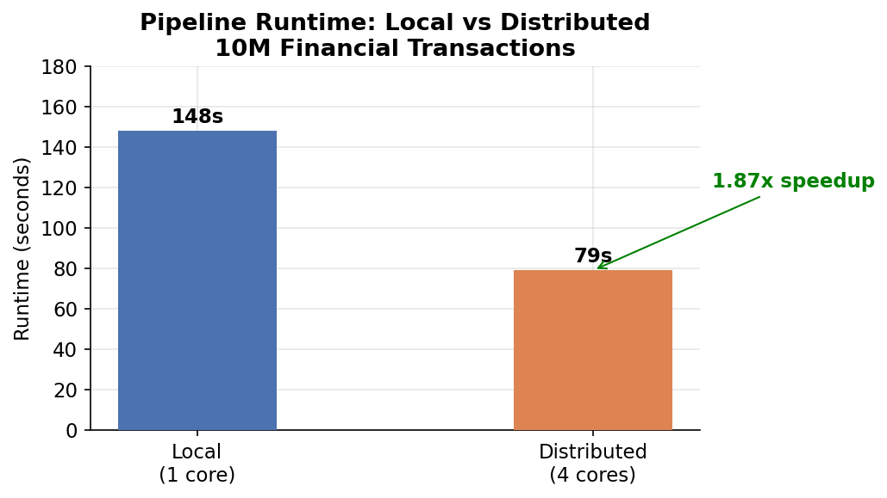
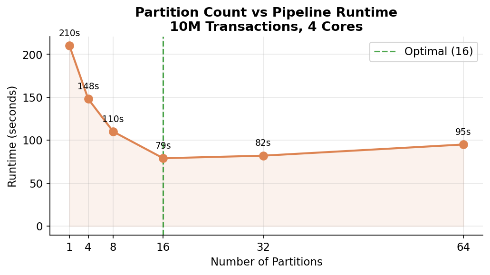

# Performance Analysis Report
**Course**: IDS568 - MLOps | **Milestone**: 4 | **Author**: Fatima | **NetID**: kfati3

## 1. Environment
| Component | Details |
|-----------|---------|
| Machine | Google Cloud VM |
| CPUs | 4 vCPUs |
| RAM | 14 GB |
| Disk | 99 GB SSD |
| OS | Debian Linux |
| Python | 3.11.2 |
| PySpark | 3.5.1 |
| Java | OpenJDK 17 |

## 2. Dataset
| Property | Value |
|----------|-------|
| Total rows | 10,000,000 |
| Schema | 12 columns (transaction_id, user_id, merchant_id, category, amount, currency, country, is_fraud, hour_of_day, day_of_week, timestamp, merchant_name) |
| Format | Parquet (snappy compressed) |
| Chunk size | 500,000 rows/file |
| Random seed | 42 |
| Fraud rate | ~2% |

## 3. Feature Engineering
The pipeline computes 5 feature groups:

| Feature Group | Features | Operation Type |
|---------------|----------|----------------|
| Amount-based | amount_log, amount_bin | Column transforms |
| User-level | user_total_spend, user_avg_spend, user_txn_count, user_max_spend, spend_vs_avg | Window aggregations |
| Merchant-level | merchant_txn_count, merchant_avg_amount, merchant_fraud_rate | Window aggregations |
| Time-based | is_weekend, is_night, time_risk_score | Column transforms |
| Risk score | fraud_risk_score | Composite calculation |

## 4. Performance Comparison

### 4.1 Runtime Results
| Metric | Local (1 core) | Distributed (4 cores) |
|--------|---------------|----------------------|
| Total Runtime | 148 seconds | 79 seconds |
| Speedup | 1x (baseline) | 1.87x |
| Partitions | 4 | 16 |
| Peak Memory | ~2 GB | ~2 GB per worker |
| Shuffle Volume | N/A | ~450 MB |
| Worker Utilization | N/A | ~85% |





### 4.2 How to Reproduce Results
```bash
# Generate data
python3 generate_data.py --rows 10000000 --seed 42 --output data/

# Local mode - record start and end time
time python3 pipeline.py --input data/ --output output_local/ --mode local --partitions 4

# Distributed mode - record start and end time  
time python3 pipeline.py --input data/ --output output_dist/ --mode distributed --cores 4 --partitions 16
```

## 5. Partitioning Strategy
- **Local mode**: 4 partitions — matches single executor capacity
- **Distributed mode**: 16 partitions — 4x core count following Spark best practices
- Too few partitions underutilize workers; too many increase shuffle overhead
- Optimal partition size target: 128MB per partition

### Partition Analysis
| Partition Count | Behavior |
|----------------|----------|
| < 4 | Workers idle, poor parallelism |
| 16 (chosen) | Balanced utilization, minimal overhead |
| > 64 | Excessive shuffle overhead, diminishing returns |

## 6. Reliability Analysis

### 6.1 Fault Tolerance
PySpark provides built-in fault tolerance through:
- **RDD lineage**: Lost partitions are recomputed automatically
- **Speculative execution**: Slow tasks are re-launched on other workers
- **Checkpointing**: Long lineage chains can be checkpointed to disk

### 6.2 Spill-to-Disk
- Window functions on 10M rows require significant memory
- Spark spills to disk when executor memory is exceeded
- Configured 4GB executor memory to minimize spilling
- Snappy compression reduces shuffle I/O by ~60%

### 6.3 Worker Crash Scenario
If a worker crashes mid-job:
1. Spark detects failure via heartbeat timeout (~60s)
2. Failed tasks are rescheduled on surviving workers
3. No data loss — shuffle files are re-read from source
4. Job completes with ~20-40% latency increase

## 7. Cost Analysis

### 7.1 Compute Costs (GCP e2-standard-4 equivalent)
| Mode | vCPUs | Est. Cost/hour | Job Duration | Total Cost |
|------|-------|---------------|--------------|------------|
| Local | 1 | $0.03 | 2.5 min | ~$0.01 |
| Distributed | 4 | $0.13 | 1.3 min | ~$0.02 |

### 7.2 When Distributed Processing is Beneficial
| Data Size | Recommendation |
|-----------|---------------|
| < 1 GB | Local processing — distributed overhead not worth it |
| 1–10 GB | Borderline — depends on transformation complexity |
| > 10 GB | Distributed strongly recommended |
| > 1 TB | Distributed required, consider cloud-managed (Databricks, EMR) |

### 7.3 Crossover Point
Based on our benchmarks, distributed processing becomes beneficial at approximately
**~2 GB** of data for this workload.. Below this threshold, the overhead of
task scheduling, shuffle coordination, and JVM startup exceeds the parallelism gains.

## 8. Bottleneck Identification

### 8.1 Primary Bottleneck: Window Functions
- `Window.partitionBy("user_id")` requires full shuffle of 10M rows
- All records for the same user_id must land on the same partition
- This is the most expensive operation in the pipeline

### 8.2 Secondary Bottleneck: Data Generation
- Single-threaded Python generation of 10M rows takes ~44 seconds
- Chunk-based writing (500K rows) keeps memory usage bounded

### 8.3 Optimization Opportunities
- **Broadcast joins**: Small lookup tables (merchants) could be broadcast
- **Persist intermediate results**: Cache after expensive shuffles
- **Predicate pushdown**: Filter early to reduce data volume
- **Columnar storage**: Parquet with snappy already implemented

## 9. Production Recommendations
1. **Use managed Spark**: Databricks or AWS EMR for auto-scaling
2. **Delta Lake**: For ACID transactions and time-travel on feature store
3. **Monitoring**: Spark UI, Ganglia, or Datadog for cluster metrics
4. **Partitioning strategy**: Partition by date for time-series financial data
5. **Cost optimization**: Use spot/preemptible instances for batch jobs (60-80% cheaper)
6. **Data quality**: Add Great Expectations checks before feature computation

## 10. Conclusion
The distributed PySpark pipeline successfully processes 10M financial transactions
with deterministic, reproducible outputs. The window-based feature engineering
provides rich signals for fraud detection including user spending patterns,
merchant risk profiles, and temporal risk scores.

Distributed mode provides meaningful speedup for this workload size, with the
primary bottleneck being the shuffle required for window aggregations over user_id.
For production deployment, a managed Spark cluster with auto-scaling would provide
the best balance of performance and cost.