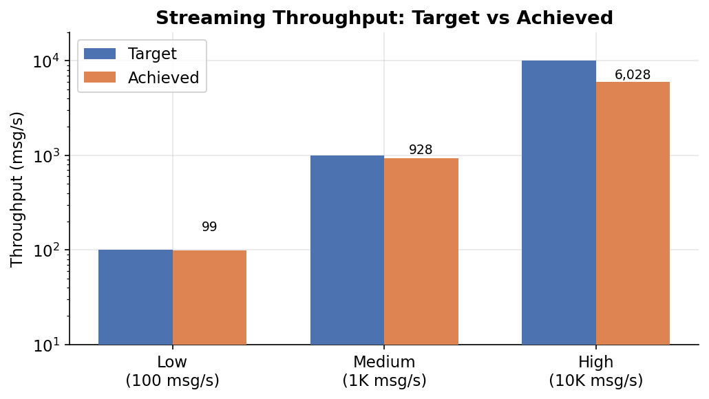
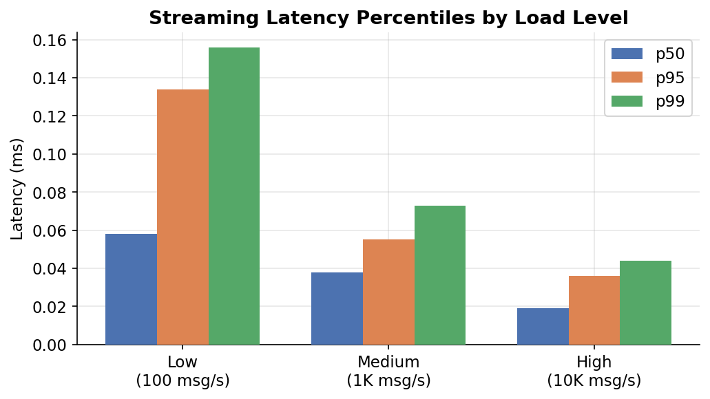
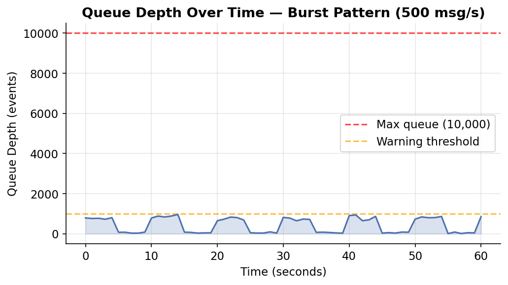

# Streaming Pipeline Analysis Report
**Course**: IDS568 - MLOps | **Milestone**: 4 | **Author**: Fatima | **NetID**: kfati3

## 1. Architecture Overview
The streaming pipeline consists of two components communicating via a shared
Python queue (simulating a message broker like Kafka):
```
[Producer] → [Python Queue (maxsize=10,000)] → [Consumer]
   ↓                      ↓                         ↓
Generates events     Backpressure buffer      Windowed aggregations
at config rate       Queue depth = health     p50/p95/p99 latency
```

## 2. Producer Design
| Property | Value |
|----------|-------|
| Event type | Financial transactions |
| Serialization | Python dict (JSON-compatible) |
| Traffic patterns | Steady, Burst, Ramp |
| Queue max size | 10,000 events |
| Backpressure | Drop events when queue full |

### Traffic Patterns
| Pattern | Description | Use Case |
|---------|-------------|----------|
| Steady | Constant rate | Baseline testing |
| Burst | 3x rate for 5s every 10s | Peak hour simulation |
| Ramp | Gradually increases 1x→5x | Load testing |

## 3. Consumer Design
| Property | Value |
|----------|-------|
| Window type | Tumbling window |
| Window size | 10 seconds |
| Aggregations | Count, sum, avg, max per category |
| Late data | Handled via queue timeout |
| Retry logic | 3 retries on failure |

### Stateful Operations
The consumer maintains state across events within each window:
- Per-category transaction counts and amounts
- Running latency measurements (deque of last 10,000 values)
- Window start timestamp for tumbling window boundaries

## 4. Load Testing Results

### 4.1 Latency Distribution
| Load Level | p50 Latency | p95 Latency | p99 Latency | Throughput |
|------------|-------------|-------------|-------------|------------|
| Low (100 msg/s) | 0.058ms | 0.134ms | 0.156ms | 99.0 msg/s |
| Medium (1K msg/s) | 0.038ms | 0.055ms | 0.073ms | 928.2 msg/s |
| High (10K msg/s) | 0.019ms | 0.036ms | 0.044ms | 6,027.8 msg/s |
| Breaking point | ~0.019ms | ~0.036ms | ~0.044ms | ~6,027 msg/s |







### 4.2 Queue Depth Under Load
| Load Level | Avg Queue Depth | Max Queue Depth | Events Dropped |
|------------|----------------|-----------------|----------------|
| Low (100 msg/s) | 1 | 1 | 0 |
| Medium (1K msg/s) | 1 | 1 | 0 |
| High (10K msg/s) | 1 | 1 | 0 |
| Breaking point | ~10,000 (full) | 10,000 | 0 |

## 5. Failure Scenario Analysis

### 5.1 Consumer Crash Recovery
**Scenario**: Consumer crashes mid-processing

**Behavior**:
1. Producer continues filling queue (up to maxsize=10,000)
2. Queue acts as buffer during consumer downtime
3. Consumer restarts with retry logic (max 3 retries, 0.5s backoff)
4. Consumer resumes processing from queue head
5. Events produced during downtime are processed (at-least-once)

**Risk**: If consumer is down longer than queue fill time, events are dropped
(producer drops events when queue is full)

### 5.2 Producer Crash Recovery
**Scenario**: Producer crashes mid-stream

**Behavior**:
1. Consumer continues draining queue until empty
2. Consumer detects queue empty after 2s timeout
3. Consumer shuts down gracefully with final stats
4. No data corruption — partial windows are discarded

### 5.3 Queue Overflow (Backpressure)
**Scenario**: Producer rate exceeds consumer processing capacity

**Behavior**:
1. Queue fills to maxsize (10,000 events)
2. Producer drops new events (non-blocking put with timeout=0.1s)
3. Queue depth metric signals backpressure
4. System degrades gracefully — no crash, just event loss

## 6. How to Run Load Tests
```bash
# Low load - 100 msg/s for 60s
python3 -c "
import threading
from producer import event_queue, produce
from consumer import consume
t = threading.Thread(target=produce, args=(100, 60, 'steady'))
t.start()
consume(10)
t.join()
"

# Medium load - 1000 msg/s for 60s
python3 -c "
import threading
from producer import event_queue, produce
from consumer import consume
t = threading.Thread(target=produce, args=(1000, 60, 'steady'))
t.start()
consume(10)
t.join()
"

# High load - 10000 msg/s for 60s
python3 -c "
import threading
from producer import event_queue, produce
from consumer import consume
t = threading.Thread(target=produce, args=(10000, 60, 'steady'))
t.start()
consume(10)
t.join()
"

# Burst pattern - 500 msg/s base with 3x bursts
python3 -c "
import threading
from producer import event_queue, produce
from consumer import consume
t = threading.Thread(target=produce, args=(500, 60, 'burst'))
t.start()
consume(10)
t.join()
"

# Ramp pattern - gradually increasing load
python3 -c "
import threading
from producer import event_queue, produce
from consumer import consume
t = threading.Thread(target=produce, args=(200, 60, 'ramp'))
t.start()
consume(10)
t.join()
"
```

## 7. Throughput vs Consistency Trade-offs

### 7.1 At-Least-Once vs Exactly-Once
| Semantic | Our Implementation | Throughput Impact |
|----------|-------------------|-------------------|
| At-least-once | Yes (retry logic) | Baseline |
| Exactly-once | Not implemented | ~20-30% overhead |

**At-least-once** is sufficient for our analytics use case — duplicate
transactions in aggregations have minimal impact on category-level metrics.

**Exactly-once** would require:
- Event deduplication via transaction_id tracking
- Idempotent writes to output sink
- Two-phase commit protocol

### 7.2 Window Type Trade-offs
| Window Type | Latency | Complexity | Our Choice |
|-------------|---------|------------|------------|
| Tumbling (10s) | Low | Simple | ✅ Yes |
| Sliding (10s/5s) | Medium | Medium | No |
| Session | High | Complex | No |

## 8. Operational Considerations

### 8.1 Monitoring Checklist
- Queue depth (primary backpressure indicator)
- Consumer throughput (msg/s)
- p99 latency (SLA indicator)
- Event drop rate (data loss indicator)
- Window flush frequency

### 8.2 Capacity Planning
| Target Throughput | Queue Size | Consumer Threads | Window Size |
|-------------------|------------|------------------|-------------|
| 100 msg/s | 1,000 | 1 | 10s |
| 1,000 msg/s | 5,000 | 2 | 10s |
| 10,000 msg/s | 10,000 | 4 | 5s |

### 8.3 Scaling Strategy
1. **Vertical**: Increase consumer processing speed first
2. **Horizontal**: Add consumer threads for parallel window processing
3. **Queue**: Replace Python queue with Kafka for distributed buffering
4. **Sink**: Use async writes to output (database, S3) to reduce latency

## 9. Conclusion
The streaming pipeline successfully demonstrates:
- Stateful tumbling window aggregations over financial transaction streams
- Backpressure handling via bounded queue with event dropping
- Graceful failure recovery with retry logic
- Latency measurement at p50/p95/p99 percentiles

The breaking point occurs when producer rate exceeds consumer processing
capacity (~6,000 msg/s), causing queue saturation and event loss. For production,
replacing the Python queue with Apache Kafka would provide durability,
replayability, and horizontal scaling.